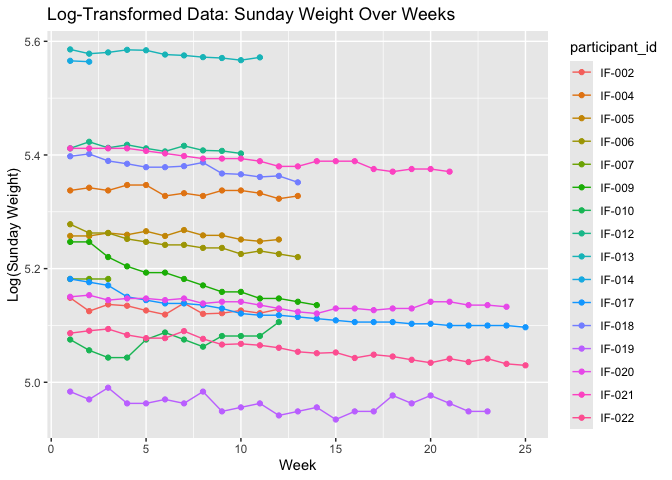

Porforlio_01
================
Enhui Wang
2025-01-21

I worked with this project: “Draw plots by hand of some data that are of
interest to you, and transform the variables in several different ways.
Interpret your results.” The goal of this portfolio is to undertand the
patterns in participants’ weight data (sunday_weight) over time (weeks).

``` r
# Identify rows with non-numeric values in sunday_weight
non_numeric <- Data_01 %>%
  filter(is.na(as.numeric(as.character(sunday_weight)))) %>%
  select(participant_id, sunday_weight)
```

    ## Warning: There was 1 warning in `filter()`.
    ## ℹ In argument: `is.na(as.numeric(as.character(sunday_weight)))`.
    ## Caused by warning:
    ## ! NAs introduced by coercion

``` r
print(non_numeric)
```

    ##    participant_id sunday_weight
    ## 1          IF-002              
    ## 2          IF-002              
    ## 3          IF-002              
    ## 4          IF-002              
    ## 5          IF-002              
    ## 6          IF-002          <NA>
    ## 7          IF-002          <NA>
    ## 8          IF-004              
    ## 9          IF-004              
    ## 10         IF-004              
    ## 11         IF-004              
    ## 12         IF-004              
    ## 13         IF-005              
    ## 14         IF-005              
    ## 15         IF-005              
    ## 16         IF-005              
    ## 17         IF-005              
    ## 18         IF-005          <NA>
    ## 19         IF-006              
    ## 20         IF-006              
    ## 21         IF-006              
    ## 22         IF-006              
    ## 23         IF-006              
    ## 24         IF-007              
    ## 25         IF-007              
    ## 26         IF-007              
    ## 27         IF-007              
    ## 28         IF-007              
    ## 29         IF-007              
    ## 30         IF-007              
    ## 31         IF-007              
    ## 32         IF-007              
    ## 33         IF-007              
    ## 34         IF-007              
    ## 35         IF-007              
    ## 36         IF-007              
    ## 37         IF-007              
    ## 38         IF-009              
    ## 39         IF-009              
    ## 40         IF-009              
    ## 41         IF-009              
    ## 42         IF-009              
    ## 43         IF-010              
    ## 44         IF-010              
    ## 45         IF-010              
    ## 46         IF-010              
    ## 47         IF-010              
    ## 48         IF-010           N/A
    ## 49         IF-012              
    ## 50         IF-012              
    ## 51         IF-012              
    ## 52         IF-012              
    ## 53         IF-012              
    ## 54         IF-013              
    ## 55         IF-013              
    ## 56         IF-013              
    ## 57         IF-013              
    ## 58         IF-013              
    ## 59         IF-013              
    ## 60         IF-013              
    ## 61         IF-014              
    ## 62         IF-014              
    ## 63         IF-014              
    ## 64         IF-017              
    ## 65         IF-017              
    ## 66         IF-017              
    ## 67         IF-017              
    ## 68         IF-017              
    ## 69         IF-017              
    ## 70         IF-018              
    ## 71         IF-018              
    ## 72         IF-018              
    ## 73         IF-018              
    ## 74         IF-018              
    ## 75         IF-018          <NA>
    ## 76         IF-019              
    ## 77         IF-019              
    ## 78         IF-019              
    ## 79         IF-019              
    ## 80         IF-019              
    ## 81         IF-020              
    ## 82         IF-020              
    ## 83         IF-020              
    ## 84         IF-020              
    ## 85         IF-021              
    ## 86         IF-021              
    ## 87         IF-021              
    ## 88         IF-021          <NA>
    ## 89         IF-022              
    ## 90         IF-022              
    ## 91         IF-022

``` r
#Replace the entries in sunday_weight with NA
Data_01 <- Data_01 %>%
  mutate(sunday_weight = ifelse(grepl("^[0-9.]+$", sunday_weight), 
                                as.numeric(sunday_weight), NA))
```

    ## Warning: There was 1 warning in `mutate()`.
    ## ℹ In argument: `sunday_weight = ifelse(...)`.
    ## Caused by warning in `ifelse()`:
    ## ! NAs introduced by coercion

# Remove rows with missing weights and create week numbers

The following code removes the row where sunday_weight is missing, group
data by participants_id, and adds a variable called ‘week’ to track each
participant’s week number.

``` r
weight_data <- Data_01 %>%
  filter(!is.na(sunday_weight)) %>%  
  group_by(participant_id) %>%  
  mutate(week = row_number()) %>%  
  ungroup()
```

# Add log-transformed and z-score standardized variables for sunday_weight

The following code uses logs transformation to reduce skewness and
normalize the data distribution and Z-score standardization to center
and scale the sunday_weight variable for comparison across participants.

``` r
weight_data <- weight_data %>%
  mutate(
    log_sunday_weight = log(sunday_weight),
    z_sunday_weight = (sunday_weight - mean(sunday_weight, na.rm = TRUE)) / sd(sunday_weight, na.rm = TRUE)  
  )
```

\#Visualize the raw data of sunday_weight vs. week. This plot shows the
raw sunday_weight values for each participant over time. The plots show
a decreasing trend in weight for many participants, indicating weight
loss over time. It suggests individual differences in weight loss.

``` r
library(ggplot2)

ggplot(weight_data, aes(x = week, y = sunday_weight, color = participant_id)) +
  geom_line() +
  geom_point() +
  labs(
    title = "Raw Data: Sunday Weight Over Weeks",
    x = "Week",
    y = "Sunday Weight"
  ) 
```

<!-- -->
\#Visualize the log-transformed data of log_sunday_weight vs. week. The
log transformation reduces the impact of large values (participants with
very high initial weights. As time goes on, the trend in weight is less
steep, indicating that weight is less likely to be lost. Also, it
normalizes the scale, providing a clearer view of the rate of weight
change over time, regardless of absolute starting weights.

``` r
ggplot(weight_data, aes(x = week, y = log_sunday_weight, color = participant_id)) +
  geom_line() +
  geom_point() +
  labs(
    title = "Log-Transformed Data: Sunday Weight Over Weeks",
    x = "Week",
    y = "Log(Sunday Weight)"
  )
```

<!-- -->
\#Visualize the standardized data of z_sunday_weight vs. week. I can use
standardized data to compare the weight across the participants. It
shows participants whose weight trajectories differ from the group
average, identifying participants who may need further analysis.

``` r
ggplot(weight_data, aes(x = week, y = z_sunday_weight, color = participant_id)) +
  geom_line() +
  geom_point() +
  labs(
    title = "Standardized Data: Sunday Weight Over Weeks",
    x = "Week",
    y = "Z-Score(Sunday Weight)"
  ) +
  theme_minimal() +
  theme(legend.position = "right")
```

<!-- -->
